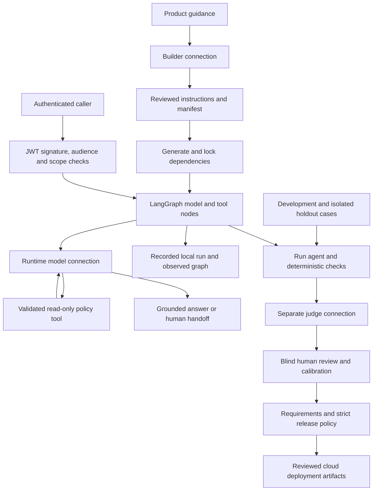

# Support agent architecture

This is the selected architecture for this example, not an automatically inferred arbitrary workflow. Inspect the executable runtime, generated configuration and observed run graph before adapting it.

The judge belongs to the development/release workflow; it is not automatically inserted into every production request. Local durable run records are operator-owned files, not a distributed cloud checkpoint service. The generated LangGraph StateGraph executes model and tool nodes within configured limits. It does not configure a cloud persistent checkpointer; choose and test one before requiring cross-instance state. `instrilo runs graph` exports the observed trajectory in Mermaid and JSON; it does not define arbitrary graph execution.

| Boundary | Tutorial | Before production |
| --- | --- | --- |
| Builder/runtime/judge | Distinct deterministic localhost routes | Independently selected authorized model/API connections and calibrated rubric |
| Policy tool | Synthetic GET fixture | Real HTTPS service, its authorization and error behavior tested |
| Caller identity | Trusted local operator | Real issuer/JWKS/audience, signed tokens and agent:invoke scope |
| Evidence | Explicitly synthetic cases and proposed requirements | Reviewed holdout cases, reviewed requirement links and human labels |
| Cloud | Generated artifacts for three targets | Selected target, account permissions, identity, secrets and live smoke checks |
| Operations | Local run JSON, replay and test reports | Monitoring, access review, budgets/rate limits, retention and rollout/rollback owned by the operator |

The local example intentionally cannot pass its production release gate. Never turn off provenance or human-review requirements just to make the tutorial green. Actual cloud deployments need new evaluation evidence after configuration changes.
